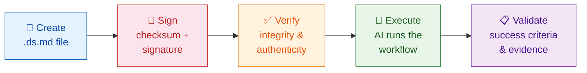
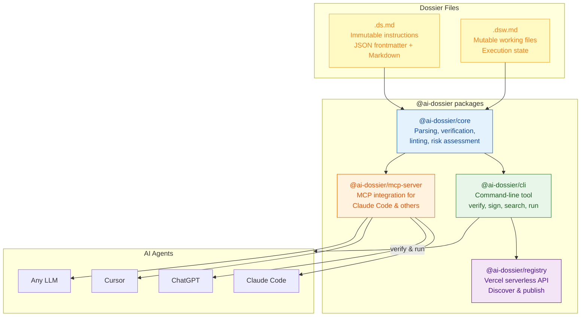
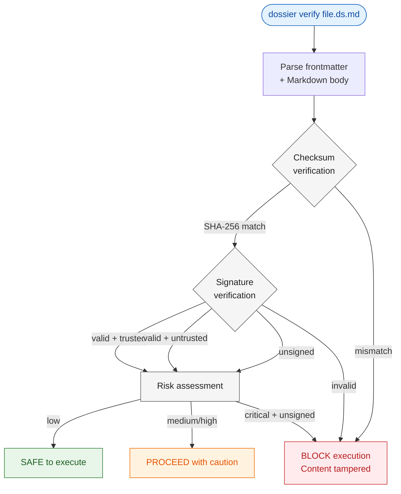
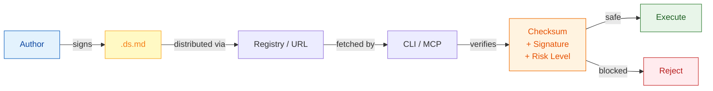
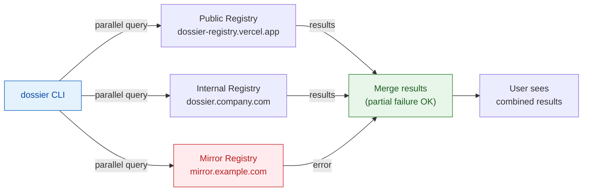

# Dossier — Portable, Signed Skills for Any AI Agent

**Skills are easy to write. Dossiers make them trustworthy, versioned, and portable across every LLM tool.**

[](https://github.com/imboard-ai/ai-dossier/actions/workflows/ci.yml)
[](https://github.com/imboard-ai/ai-dossier/actions/workflows/test-examples.yml)
[](https://www.npmjs.com/package/@ai-dossier/cli)
[](https://www.npmjs.com/package/@ai-dossier/cli)
[](LICENSE)
[](docs/reference/README.md)
[](mcp-server)
[](docs/explanation/security-model.md)
[](https://github.com/imboard-ai/ai-dossier)

> **Quick Concept**
> A dossier is a skill — a reusable instruction set an AI executes — with trust, versioning, and cross-tool portability built in.
> Think npm or Docker Hub, but for AI skills: signed, versioned, shareable.

```
  ┌──────────────────────────────────────────────────────────────────────┐
  │                                                                      │
  │    Write instructions       Verify integrity       AI executes       │
  │    in Markdown (.ds.md)     with checksums &       the workflow      │
  │                             signatures             intelligently     │
  │                                                                      │
  │    ┌──────────┐    sign     ┌──────────┐   run     ┌──────────┐     │
  │    │  Author  │ ─────────> │  Verify  │ ────────> │ AI Agent │     │
  │    └──────────┘            └──────────┘            └──────────┘     │
  │         │                       │                       │            │
  │     .ds.md file            checksum +              validated         │
  │     with JSON              signature               results with     │
  │     frontmatter            verification            evidence         │
  │                                                                      │
  └──────────────────────────────────────────────────────────────────────┘
```

**New here?** → [5-min Quick Start](docs/getting-started/quick-start.md) | **Using Claude Code?** → [MCP in 60 Seconds](docs/tutorials/mcp-quickstart.md) | **Want to try now?** → [Get started in 30 seconds](#get-started)

---

## At a Glance



**What**: Skills (`.ds.md` files) any AI agent can run — signed, versioned, portable across tools
**Why**: A plain skill lives in one tool and anyone can tamper with it; a dossier is that same skill made verifiable, version-pinned, and shareable
**Safety**: Built-in checksums, cryptographic signatures, and CLI verification tools
**Works with**: Claude, ChatGPT, Cursor, any LLM — no vendor lock-in

**Status**: Protocol v1.0 (stable spec) | CLI v0.8.5 | 15+ example skills | Active development

> **File conventions**: Dossiers use `.ds.md` (immutable instructions) and `.dsw.md` (mutable working files). Frontmatter uses `---dossier` (JSON) instead of `---` (YAML) to avoid parser conflicts. [Learn more](docs/explanation/faq.md#what-do-the-dsmd-and-dswmd-file-extensions-mean)

---

## Get Started

### 1. Run a dossier — zero install

Pick any LLM you already have and paste this:

```
Analyze my project using the dossier at:
https://raw.githubusercontent.com/imboard-ai/ai-dossier/main/examples/guides/context-engineering-best-practices.ds.md
```

That's it. The LLM reads the dossier and follows its instructions — no tools needed.

Want to verify it first?

```bash
npx @ai-dossier/cli verify https://raw.githubusercontent.com/imboard-ai/ai-dossier/main/examples/guides/context-engineering-best-practices.ds.md
```

### 2. Add the MCP server to Claude Code

One command gives Claude Code native dossier support — discover, verify, and execute dossiers without copy-pasting URLs:

```bash
claude mcp add dossier --scope user -- npx @ai-dossier/mcp-server
```

Then ask Claude: *"List available dossiers"* or *"Run the scaffold-typescript-project dossier"*.

<details>
<summary>Alternative: Claude Code plugin (auto-updates)</summary>

```
/plugin marketplace add imboard-ai/ai-dossier
/plugin install dossier-mcp-server@ai-dossier
```
</details>

<details>
<summary>Alternative: Manual JSON config (Claude Desktop or other MCP clients)</summary>

Add to `claude_desktop_config.json` or your MCP client's config file:

```json
{
  "mcpServers": {
    "dossier": {
      "command": "npx",
      "args": ["-y", "@ai-dossier/mcp-server"]
    }
  }
}
```
</details>

### 3. Create your own dossier

Initialize dossier in your project (sets up `~/.dossier/`, hooks, and MCP config):

```bash
npx @ai-dossier/cli init
```

Then create a dossier:

```bash
npx @ai-dossier/cli create my-workflow
```

This scaffolds a `.ds.md` file you can edit. A dossier is just Markdown with a JSON frontmatter block:

```markdown
---dossier
{
  "title": "My Workflow",
  "version": "1.0.0",
  "protocol_version": "1.0",
  "status": "draft",
  "objective": "Describe what this automates",
  "risk_level": "low"
}
---

# My Workflow

## Actions
1. Step one — what to do
2. Step two — what to verify

## Validation
- Expected outcome was achieved
```

See the [Authoring Guide](docs/guides/authoring-guidelines.md) for the full spec, or browse the [Dossier Registry](https://dossier-registry.vercel.app) for real-world examples.

---

## Why Use Dossier?

**"Isn't this just a skill?"** Yes — a dossier *is* a skill. The difference is everything a plain skill (like a Claude Code `SKILL.md`) lacks:

|  | Plain skill (`SKILL.md`) | Dossier |
|--|--------------------------|---------|
| **Trust** | Unsigned — anyone can tamper | Checksum + cryptographic signature, verified before run |
| **Versioning** | Informal | Semantic versioning you can pin |
| **Distribution** | Copy-paste / per-tool | Registry — discoverable, `ai-dossier install-skill` |
| **Portability** | Locked to one tool | Same file runs on Claude, ChatGPT, Cursor, any LLM |
| **Validation** | None | Built-in success criteria |

**Trigger skills bridge the two**: a thin `SKILL.md` whose job is to invoke a versioned, signed dossier (`ai-dossier run <registry-path>`) — you keep the natural-language trigger *and* gain signing, versioning, and registry distribution.

**"How about AGENTS.md files?"** Different job: `AGENTS.md` explains *your project*; a dossier automates a *workflow*. They're complementary.

---

## Architecture



### Verification Pipeline

Every dossier goes through a multi-stage security pipeline before execution:



See [ARCHITECTURE.md](ARCHITECTURE.md) for the full system architecture.

---

## Examples

| Example | Use Case |
|---------|----------|
| [Scaffold TypeScript Project](./examples/setup/scaffold-typescript-project.ds.md) | Scaffold a production-ready TS project with CI, testing, linting |
| [Context Engineering Best Practices](./examples/guides/context-engineering-best-practices.ds.md) | Reference guide for writing effective AI agent context files |

Browse the **[Dossier Registry](https://dossier-registry.vercel.app)** for the full collection — DevOps, databases, data science, security, and more.

```bash
# Search from the CLI
npx @ai-dossier/cli search deploy
```

---

## Security & Verification



- Use the CLI tool (`ai-dossier verify`) to verify checksums/signatures before execution
- Prefer MCP mode for sandboxed, permissioned operations
- **External reference declaration**: Dossiers that fetch or link to external URLs must declare them in `external_references` with trust levels. The linter flags undeclared URLs, and the MCP server's `read_dossier` tool returns `security_notices` for any undeclared external URLs found in the body. This mitigates transitive trust risks from unvetted external content.
- See [SECURITY_STATUS.md](./SECURITY_STATUS.md) for current guarantees and limitations

---

## Registry & Multi-Registry Support

The CLI supports multiple registries for discovering, publishing, and sharing dossiers across teams and organizations.



- **Multi-registry**: Configure multiple registries (public, internal, mirrors) queried in parallel
- **HTTPS enforcement**: All registry URLs must use HTTPS to protect credentials in transit
- **Per-registry credentials**: Each registry has isolated authentication — a compromised token cannot access other registries
- **Project-level config**: Add a `.dossierrc.json` to your project for team-shared registry settings

```bash
# Add a private registry
dossier config --add-registry internal --url https://dossier.company.com

# List configured registries
dossier config --list-registries
```

See the [CLI documentation](./cli/README.md#config-command) for full registry management options.

---

## Adopter Playbooks

- **Solo Dev**: paste a `.ds.md` into your LLM and run via MCP or CLI
- **OSS Maintainer**: add `/dossiers` + a CI check that runs the Reality Check on your README
- **Platform Team**: start with init -> deploy -> rollback dossiers; wire secrets & scanners

Detailed playbooks in [docs/guides/adopter-playbooks.md](docs/guides/adopter-playbooks.md)

---

## Documentation

| | |
|---|---|
| **Getting Started** | [Quick Start](docs/getting-started/quick-start.md) · [Installation](docs/getting-started/installation.md) · [MCP in 60 Seconds](docs/tutorials/mcp-quickstart.md) · [Your First Dossier](docs/tutorials/your-first-dossier.md) · [FAQ](docs/explanation/faq.md) |
| **Reference** | [Protocol](docs/reference/protocol.md) · [Specification](docs/reference/specification.md) · [Schema](docs/reference/schema.md) · [JSON Schema](./dossier-schema.json) |
| **Guides** | [Authoring Guidelines](docs/guides/authoring-guidelines.md) · [Dossier Guide](docs/guides/dossier-guide.md) · [CI/CD Integration](docs/guides/ci-cd-integration.md) · [Execution Tracing](docs/guides/tracing.md) · [Adopter Playbooks](docs/guides/adopter-playbooks.md) · [Examples](./examples/) |
| **Packages** | [CLI](./cli/) · [MCP Server](./mcp-server/) · [Core Library](./packages/core/) · [Registry](./registry/) |
| **Project** | [Architecture](ARCHITECTURE.md) · [Contributing](CONTRIBUTING.md) · [Security](SECURITY.md) · [Changelog](CHANGELOG.md) |

---

## Philosophy

> "A skill tells an agent what to do. A dossier lets you trust it."

Dossiers take the skill — a reusable instruction set any AI can run — and add the things that make it safe to share: a verifiable signature, a pinnable version, and a registry to distribute it through.

**The dossier standard** enables:
- **Trust**: cryptographic signatures and checksums, verified before execution
- **Versioning**: semantic versions you can pin and upgrade deliberately
- **Distribution**: a registry that makes skills discoverable and installable
- **Portability**: any project, any workflow, any LLM — no vendor lock-in
- **Adaptability**: agents understand context and adjust behavior

---

**Dossier: Portable, Verifiable Skills for Any LLM**
*Skills you can trust.*

---

## License

This project is licensed under the [GNU Affero General Public License v3.0 (AGPL-3.0)](LICENSE). You are free to use, copy, modify, and distribute it, provided that any modified versions or network services using this software also make their source code available under the same license.

## References

See [REFERENCES.md](REFERENCES.md) for the full list of academic references and industry research supporting the dossier approach.
