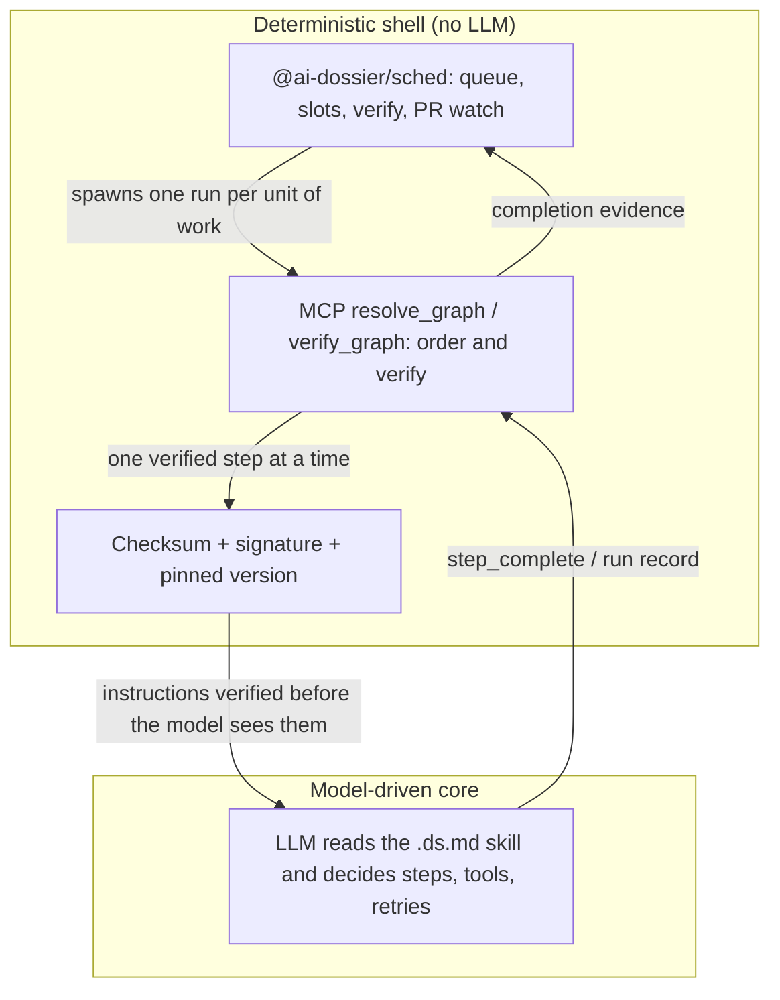

# Model-driven orchestration for AI agents: what it is, and how Dossier makes it trustworthy

**Model-driven orchestration** is a way of building AI agents in which the model, not hand-written code, decides the steps, the tool calls, the retries and when the work is done. **Hybrid model-driven orchestration**, the approach Dossier takes, keeps the model in charge inside each skill and wraps the whole thing in a deterministic shell: signed, version-pinned skills, and a scheduler that never calls an LLM.

## Code-driven vs model-driven orchestration

There are two ways to get an LLM to do a multi-step job.

**Code-driven.** You write the control flow. The model fills in a step, the code decides what happens next. Anthropic's [Building effective agents](https://www.anthropic.com/engineering/building-effective-agents) calls this a workflow: "Workflows are systems where LLMs and tools are orchestrated through predefined code paths." Will Larson, in [Building an internal agent: Code-driven vs LLM-driven workflows](https://lethain.com/agents-coordinators/) (December 31, 2025), describes using code-driven workflows as a "solution of frequent resort", a progressive enhancement "where LLM prompts and tools aren't reliable or quick enough". The research paper [Blueprint First, Model Second](https://arxiv.org/abs/2508.02721) (Qiu et al., submitted August 1, 2025) goes furthest: it argues that "the inherent non-determinism of large language model (LLM) agents limits their application in structured operational environments", and proposes decoupling workflow logic from the model by first codifying an expert procedure into a source code-based "Execution Blueprint".

**Model-driven.** You hand the model a goal, tools and context, and it plans. Anthropic's term for this is an agent: "systems where LLMs dynamically direct their own processes and tool usage, maintaining control over how they accomplish tasks." AWS popularised the name *model-driven approach* with [Strands Agents](https://aws.amazon.com/blogs/opensource/introducing-strands-agents-an-open-source-ai-agents-sdk/) (Clare Liguori, May 16, 2025): "In a model-driven approach, the agent uses the model to dynamically direct its own steps and to use tools in order to accomplish the specified task." The follow-up, [Strands Agents and the Model-Driven Approach](https://aws.amazon.com/blogs/opensource/strands-agents-and-the-model-driven-approach/) (Arron Bailiss, September 12, 2025), puts the bet plainly: "Modern models are sophisticated enough to be their own orchestrators." Credit for the term belongs to the Strands team; Dossier did not coin it.

Neither side is free. The honest tradeoffs:

| | Code-driven | Model-driven |
|---|---|---|
| Flexibility | Only the paths you anticipated | Adapts to cases nobody wrote a branch for |
| Predictability | High; the same input takes the same path | Lower; the path can differ run to run |
| Cost and latency | Lower and bounded | Higher. Anthropic: "Agentic systems often trade latency and cost for better task performance" |
| Failure mode | Brittle when reality leaves the script | Variance, and in Anthropic's words "the potential for compounding errors" |
| Authoring effort | Engineering time per workflow | Writing good instructions |

The practical answer in most teams is a mix, which is where the hybrid comes in.

## Hybrid model-driven orchestration: how Dossier does it

Dossier's hybrid is **model-driven inside each skill, deterministic around it.** Four layers, from the inside out:

1. **The model drives inside each `.ds.md` skill.** A dossier is an agent skill with a version and a signature. Its Markdown body tells the model what to achieve; the model decides the steps, tool calls, retries and validation. There is no code-defined workflow engine inside a skill.
2. **Skills are signed and version-pinned.** Each dossier carries a SHA-256 checksum and an Ed25519 or KMS signature in its frontmatter, and you can pin an exact version (`ai-dossier pull org/my-dossier@1.2.0`). The instructions the model follows are the instructions that were published.
3. **Multi-skill journeys run through MCP.** A dossier declares `relationships` (such as `preceded_by`). The MCP server's `resolve_graph` tool turns them into an ordered plan, `verify_graph` batch-verifies every dossier in it, and `start_journey` / `step_complete` hand the model one verified step at a time. Cycle detection, ordering and verification are ordinary code. The full tool reference is in [ORCHESTRATION.md](../../ORCHESTRATION.md).
4. **Batch runs go through a deterministic scheduler.** [`@ai-dossier/sched`](../../packages/sched/README.md) queues work, manages worker slots, verifies completion against ground truth, watches pull requests and recovers stalled runs. By its own description it "never invokes an LLM": it spawns the agent process you configured and reconciles what that run left behind.



The model never decides which skill is trusted, which version runs, how many agents are alive, or whether a unit of work really finished. Code decides those. The model decides how to do the work.

## Why model-driven orchestration needs trust

In a code-driven system the program is code you reviewed and deployed. In a model-driven one, **the instructions are the program.** Whoever controls the text the model reads controls what it does with the tools it holds, including a shell, a filesystem and credentials.

That makes skills a supply-chain surface. Red Hat's [Agent Skills: Explore security threats and controls](https://developers.redhat.com/articles/2026/03/10/agent-skills-explore-security-threats-and-controls) (Florencio Cano Gabarda, March 10, 2026) notes that skills "may contain executable scripts in different languages, such as Python or Bash", that "these scripts may contain malware", and that if an automatic upgrade mechanism exists, "an upgrade can include malicious code or vulnerabilities, especially if they come from untrusted sources." It adds: "There is no widely known initiative to sign Agent Skills, but this is something that users and customers should require if they consider it a relevant security control."

Dossier's controls map onto that threat directly:

- **Checksums** detect any change to a skill after it was published. A tampered file fails verification before the model reads it.
- **Signatures** bind a skill to a key, so you can tell who wrote it. Keys you trust are managed with `ai-dossier keys`.
- **Version pinning** means a skill cannot silently change underneath a running pipeline. You upgrade on purpose.
- **Verification before execution**: the CLI and the MCP server verify before a dossier runs, and `verify_graph` does it for every step of a journey. The [security demonstration](security-model.md) shows what happens without that layer: a dossier that looks legitimate to a reader, and to the model, still exfiltrates secrets.

**The caveat, stated plainly.** Verification proves integrity and origin: the file is the one the signer published, and unchanged. It does not prevent prompt injection and it does not make a skill safe to run. A correctly signed skill can still be a bad skill. Read what you are about to run, trust signers deliberately, and treat the risk level and [security model](security-model.md) as inputs to your judgment, not a substitute for it.

## A concrete walkthrough

The repo ships a small signed dossier, [`examples/test/hello-world.ds.md`](../../examples/test/hello-world.ds.md). Here is its life, from authoring to running.

**1. Author.** `ai-dossier create` scaffolds a `.ds.md` file: JSON frontmatter (title, version, risk level, tools required) followed by Markdown instructions for the model. The hello-world body is a few lines of prose, because the point of the example is the signature.

**2. Sign.** `ai-dossier sign` computes the checksum and writes the signature into the frontmatter. With a local key:

```bash
ai-dossier sign my-skill.ds.md --method ed25519 --key my-key --signed-by "Name <name@example.com>"
```

The hello-world file carries an Ed25519 signature from a test key, `test-key-2025`, signed on 2025-11-19.

**3. Verify.** Verification runs on the signed file, without any registry:

```bash
ai-dossier verify examples/test/hello-world.ds.md
```

The output reports the checksum as valid ("content has not been tampered with") and the signature as valid, but with a warning that the signing key is not in your trusted list, along with the command to add it. That distinction is the useful part: integrity (the checksum) and origin (a key you chose to trust) are separate questions.

**4. Publish and pin.** `ai-dossier publish` puts the skill in a registry, and consumers pin it: `ai-dossier pull org/my-skill@1.0.0`.

**5. Run.** `ai-dossier run org/my-skill` verifies the checksum and signature, then hands the instructions to the model. From here the model drives. If the skill is one step of a longer journey, MCP orders and verifies the steps; if it is one of fifty issues in a batch, the scheduler decides when it starts and whether it counts as done.

## FAQ

### What is model-driven orchestration?

It is orchestration where the model decides the steps, tool calls, retries and stopping point, rather than a hand-coded graph or state machine. AWS Strands Agents popularised the phrase as the "model-driven approach". Dossier makes it safe to share and repeat by signing and pinning every skill.

### What is the difference between model-driven and code-driven orchestration?

In code-driven orchestration, code owns the control flow and the model fills in steps. In model-driven orchestration, the model owns the control flow. Code-driven is more predictable and cheaper. Model-driven is more flexible and costs more in latency and variance. See the table above, and the sources by [Anthropic](https://www.anthropic.com/engineering/building-effective-agents) and [Larson](https://lethain.com/agents-coordinators/).

### What is hybrid model-driven orchestration?

It is Dossier's term for model-driven inside each skill and deterministic around it: signed, version-pinned skills, MCP-resolved multi-skill journeys, and a scheduler that never calls an LLM. The goal is to keep the model's flexibility where it earns its cost, and put code where you need guarantees.

### Is model-driven orchestration safe?

Not by default. When the model is the orchestrator, the instructions it reads are the program, so an altered or malicious skill is a real attack path. Signing and checksums let you verify that a skill is unchanged and who published it. They do not prove the skill is harmless, and they do not stop prompt injection. See the [security model](security-model.md).

### Does Dossier replace SKILL.md or Agent Skills?

No. Dossier is a layer on top of agent skills: signing and versioning for the skills you already write. A thin `SKILL.md` can invoke a signed dossier, and `install-skill` and `skill-export` move skills between the two. See [Isn't a dossier just a skill?](faq.md#isnt-a-dossier-just-a-skill).

## Further reading

- [ORCHESTRATION.md](../../ORCHESTRATION.md): the MCP orchestration tool reference
- [`@ai-dossier/sched`](../../packages/sched/README.md): the deterministic scheduler
- [Security model](security-model.md): the supply-chain demonstration
- [Explanation index](README.md)
